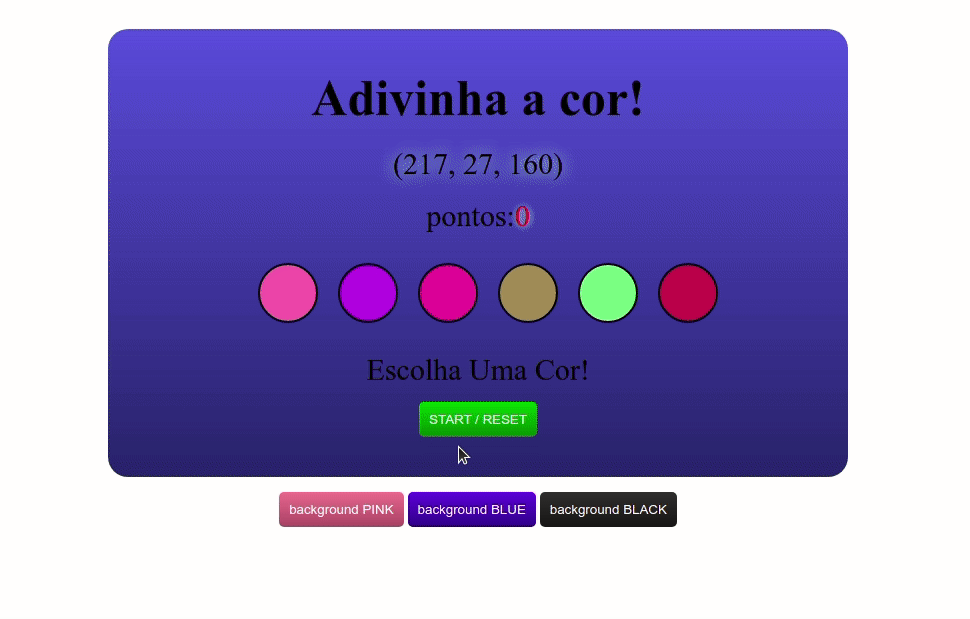
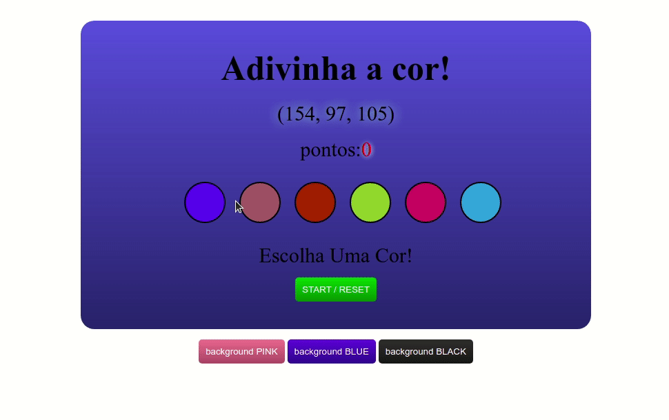

# ColorGuess Project
## A Trybe study project that create and modifies elements through DOM.

  
  

  

## :rocket: Technologies
This project was developed with the following technologies:   

- :heavy_check_mark: HTML
- :heavy_check_mark: CSS
- :heavy_check_mark: Javascript 
  

## About this project

The idea about this project is: 
- Generate random colors on reload and start/reset. 
- Generate a ball color with the same RGB text value. 
- Create a dinamic score. 
  - +3 when choose the right color.
  - +0 when choose the wrong color.
- Be able to define the background colors (pink, blue and black). 
- Be able to restart the game and not lose the score. 
---
 

### Made with :purple_heart: by Patrick =)  

### Connect with me at [LinkedIn!](https://www.linkedin.com/in/patrick-morais/)